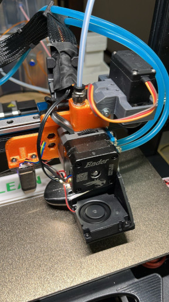

# SEFC
Sprite Extruder Filament Cutter

After building the ERCF, v1.1 in my case, I went through the battle of calibrate it.
Everything went fine, after I found the right top hats. But, the tip forming calibration
time arrived! And I didnt, and still dont, use a Voron-style toolhead, so there is no 
filament sensors. I spent many hours, asked in the forums and channels, but I wasnt able
to have it in a reliable way. It worked but not always :(

So I decided to look for a filament cutter. I bought a EREC kit from AliExpress and I was
thinking to upgrade my ERCF from version 1.1 to version 2.0. But I started to pay attencion
in the tip that I was getting from the tip forming process. It was not regular when it didnt
work, sometimes a very long string sometimes a short one, and I thought how will EREC deal with
these situations?

Then I decide to look for a toolhead filament cutter, but most of the projects were for a Voron-like
toolhead, until I found the "Sprite Extruder Filament Cutter (SEFC)" from DrawModelPrint, 
https://www.thingiverse.com/thing:6629071.

I built it but didn't work for me as the stepmotor couldnt press the arm strong enough to cut 
the filament.

I decided to look for a filament cutter servo-driven, but I couldnt find any project for the
sprite extruder. At some point I came across with the "Filament-Cutter for Bondtech LGX-Lite Extruder"
from technik.gegg, https://thangs.com/designer/technik.gegg/3d-model/Filament-Cutter%20for%20Bondtech%20LGX-Lite%20Extruder-69552.

I tought then, how about I merge these two projects With that, SEFC was born.

Today I am using it and it has been working fine so far. It is not perfect but it does the job. 

As the printer is using the original board, there is no available pin to connect the servo control,
to overcome it, I bought a RP2040 Zero from AliExpress and connect it to the PAD7 (or SonicPad) and 
add the configuration and macros. 

If you build it, let me know how it works for you. 

## Material

1x Compression Spring 15mm 0.4mm OD (0.4x5x15mm) 
    https://amzn.eu/d/ak1jHkr
1x Blade #4 (need to cut it so the body is 10mm outside the block) 
    https://www.amazon.nl/dp/B08J6G87PL
    I bought this kit as I was trying different blade models
1x Servo MG996R from the EREC kit from Seleadlab (AliExpress)
    https://a.aliexpress.com/_EIvgRve
    I only used the servo
1x Straight Pneumatic Push fittings
    https://www.amazon.nl/dp/B0D87GVJ92

and the parts to print in the STL folder